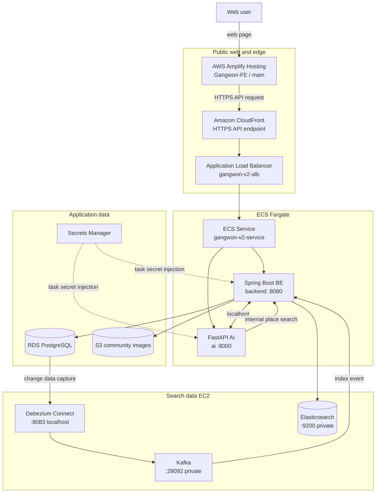
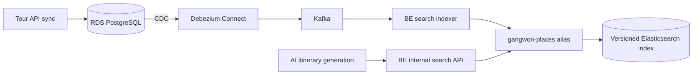
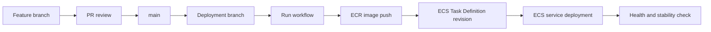

# Gangwon Companion v2 배포 환경

## 이 문서가 다루는 환경

이 문서는 2026-09-18에 구축한 `gangwon-v2` 운영 환경을 팀에 공유하기 위한
진입 문서입니다. 기존 루트 [README.md](README.md)와 Terraform 구성은 그대로
유지합니다.

`gangwon-v2`는 현재 AWS Console과 CloudShell에서 구축된 별도 운영 환경이며,
아직 이 저장소의 Terraform state로 관리되지 않습니다. 현재 서비스를 다시
배포하거나 삭제하지 않고, 팀 검토 후 기존 자원을 Terraform에 import할 예정입니다.

## 서비스 주소

- 프런트엔드: <https://main.d2pv5x1bch76t6.amplifyapp.com>
- API: <https://d3k1n6opsrtmw0.cloudfront.net>
- 상태 확인: <https://d3k1n6opsrtmw0.cloudfront.net/actuator/health>
- AWS 리전: `ap-northeast-2` (서울)

## 현재 운영 상태

2026-09-18 기준으로 다음 항목을 운영 환경에서 확인했습니다.

- FE 회원가입, 로그인과 주요 사용자 시나리오 동작
- CloudFront를 통한 BE health check `200 OK`
- 관광지, 음식점과 숙소 검색
- AI 당일 및 1박 2일 여행 일정 생성, 저장과 삭제
- RDS 변경 데이터를 Elasticsearch에 반영하는 검색 파이프라인
- FE `main` 자동 배포와 BE/AI GitHub Actions 배포

애플리케이션 기능의 세부 결함과 개선 사항은 각 애플리케이션 저장소에서 관리합니다.

## 시스템 아키텍처



### 핵심 구성 요소

| 계층 | AWS 서비스/구성 | 역할 |
| --- | --- | --- |
| Web | Amplify Hosting | `Gangwon-FE/main` 빌드와 정적 웹 호스팅 |
| Edge | CloudFront | HTTPS API 진입점, ALB origin 연결, API 캐시 비활성화 |
| Load balancing | ALB | 외부 API 요청을 ECS BE 8080 포트로 전달 |
| Application | ECS Fargate | 하나의 Task에서 BE와 AI 컨테이너 실행 |
| Database | RDS PostgreSQL | 회원, 장소, 여행, 커뮤니티 데이터 저장 |
| Object storage | S3 | 커뮤니티 이미지 저장 |
| Search pipeline | Data EC2 | Kafka, Debezium Connect, Elasticsearch 실행 |
| Secrets | Secrets Manager | DB 비밀번호, JWT와 내부 API key를 Task에 주입 |
| Container image | ECR | BE와 AI Docker image 저장 |
| Observability | CloudWatch Logs | `/ecs/gangwon-v2`에서 BE와 AI 로그 수집 |

## 애플리케이션 요청 흐름

```text
사용자
  -> Amplify의 FE 접속
  -> CloudFront API 주소 호출
  -> ALB
  -> ECS backend :8080
  -> 필요한 경우 localhost:8000의 AI 호출
  -> JSON 응답
```

- FE에는 `EXPO_PUBLIC_API_URL`로 CloudFront API 주소를 주입합니다.
- CloudFront viewer protocol policy는 HTTP 요청을 HTTPS로 전환합니다.
- BE와 AI는 같은 ECS Task 안에서 `localhost`로 통신합니다.
- AI 8000 포트는 인터넷에 직접 공개하지 않습니다.

## 검색 데이터 흐름



- 장소 목록과 상세 정보 동기화 결과는 먼저 RDS에 저장됩니다.
- 변경 사항은 Debezium과 Kafka를 통해 Elasticsearch에 점진적으로 반영됩니다.
- `gangwon-places`는 실제 version index를 가리키는 write alias입니다.
- 전체 재색인은 최초 구성, mapping 변경 또는 장애 복구 시에만 수행합니다.

## 네트워크와 보안 경계

- 인터넷 진입점은 Amplify, CloudFront와 ALB로 제한합니다.
- Kafka 29092와 Elasticsearch 9200은 backend security group에서만 접근합니다.
- Debezium Connect 8083은 데이터 EC2의 localhost에서만 접근합니다.
- Elasticsearch security가 비활성화돼 있으므로 9200을 공개하지 않습니다.
- 애플리케이션 비밀값은 GitHub나 Task Definition의 평문이 아닌 Secrets Manager에서 주입합니다.
- GitHub Actions는 장기 Access Key 대신 OIDC 임시 자격 증명을 사용합니다.

## 배포 방식

| 대상 | 운영 브랜치 | 배포 방식 |
| --- | --- | --- |
| FE | `main` | Amplify 자동 배포 |
| BE | `feature/aws-data-deploy` | GitHub Actions `Deploy BE to ECS` 수동 실행 |
| AI | `feature/aws-deploy` | GitHub Actions `Deploy AI to ECS` 수동 실행 |

기능 변경은 먼저 각 저장소의 `main`에 PR로 병합합니다. 이후 원격 `main`을
배포 브랜치에 병합하고 해당 브랜치에서 workflow를 실행합니다. BE와 AI가 같은
Task Definition을 갱신하므로 두 배포는 동시에 실행하지 않습니다.



배포가 완료되면 health endpoint, ECS running task 수와 CloudWatch 로그를 확인합니다.
AI 여행 생성은 비동기 작업이므로 `PENDING`, `RUNNING`, `COMPLETED` 상태까지
확인합니다.

## 주요 리소스

| 구분 | 이름 |
| --- | --- |
| Amplify App | `Gangwon-FE` / App ID `d2pv5x1bch76t6` |
| CloudFront | `gangwon-v2-api` / `E1D6RD447KHOLK` |
| ECS Cluster | `gangwon-v2-cluster` |
| ECS Service | `gangwon-v2-service` |
| ECS Task family | `gangwon-v2-app` |
| BE ECR | `gangwon-v2-be` |
| AI ECR | `gangwon-v2-ai` |
| RDS | `gangwon-v2-db` |
| Search alias | `gangwon-places` |
| CloudWatch log group | `/ecs/gangwon-v2` |

전체 inventory와 각 리소스의 역할은
[v2 리소스 목록](docs/V2_RESOURCE_INVENTORY.md)에서 확인합니다.

## 빠른 운영 확인

API 상태 확인:

```bash
curl -i https://d3k1n6opsrtmw0.cloudfront.net/actuator/health
```

데이터 EC2 내부에서 검색 서비스 확인:

```bash
curl -fsS http://localhost:9200/_cluster/health
curl -fsS http://localhost:9200/_cat/aliases/gangwon-places?v
curl -fsS http://localhost:8083/connectors
sudo docker compose ps
```

장애 대응과 배포 확인 절차는
[v2 배포 및 운영 절차](docs/V2_DEPLOYMENT_RUNBOOK.md)를 따릅니다.

## 상세 문서

- [v2 시스템 아키텍처](docs/V2_SYSTEM_ARCHITECTURE.md)
- [v2 리소스 목록](docs/V2_RESOURCE_INVENTORY.md)
- [v2 배포 및 운영 절차](docs/V2_DEPLOYMENT_RUNBOOK.md)
- [v2 Terraform 편입 계획](docs/V2_TERRAFORM_MIGRATION.md)

## 현재 관리 경계

- 기존 루트 Terraform: 기존 `gangwon-companion-prod` 환경
- 이 문서의 대상: 별도로 구축된 `gangwon-v2` 환경
- 현재 v2 관리 방식: AWS Console/CloudShell과 애플리케이션 GitHub Actions
- 향후 목표: 현재 자원을 삭제하지 않고 별도 v2 state에 import

기존 Terraform state와 실제 AWS 자원을 대조하기 전에는 루트에서
`terraform apply`를 실행하지 않습니다.

## 보안 주의사항

이 저장소는 공개 저장소입니다. 다음 정보는 문서나 Git에 기록하지 않습니다.

- 비밀번호, API key, access token
- Secret ARN 전체 값과 Secret 내용
- 데이터 EC2 사설 IP
- 민감한 환경 변수와 Terraform state
