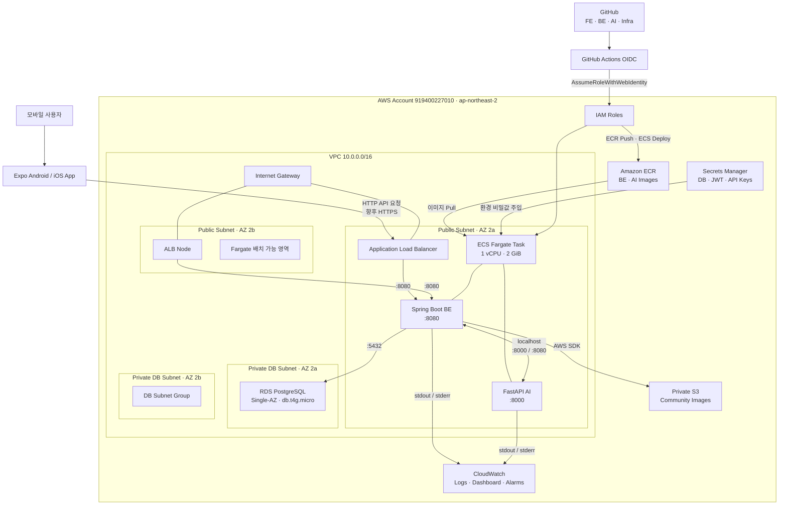
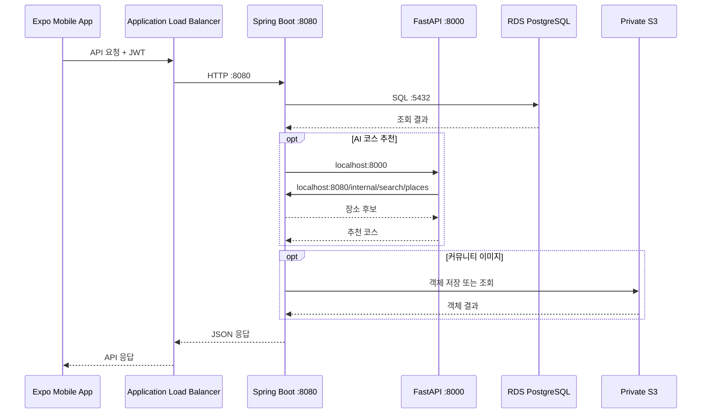
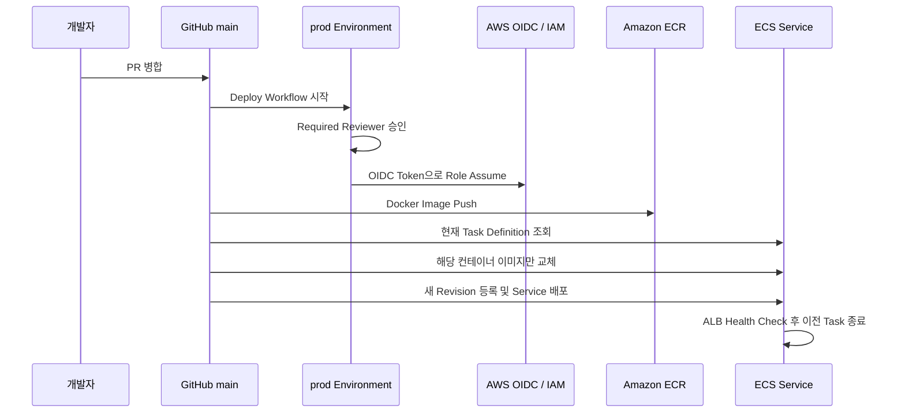

# Gangwon Companion 시스템 아키텍처

## 1. 아키텍처 요약

Gangwon Companion은 Expo 모바일 앱, Spring Boot API, FastAPI AI 서버로 구성됩니다.

- 모바일 앱은 AWS에 정적 호스팅하지 않고 Expo Go 또는 EAS Build로 배포합니다.
- 외부 API 요청은 Public ALB를 통해 Spring Boot 컨테이너로 전달됩니다.
- Spring Boot와 FastAPI는 하나의 ECS Fargate Task에 함께 배치됩니다.
- 두 컨테이너는 같은 네트워크 공간에서 `localhost`로 통신합니다.
- RDS PostgreSQL은 Private DB Subnet에 있으며 외부에서 직접 접근할 수 없습니다.
- 이미지와 비밀값은 각각 ECR과 Secrets Manager에서 Task 시작 시 공급됩니다.
- 로그와 주요 운영 지표는 CloudWatch에 수집됩니다.

## 2. 전체 시스템 구조도



## 3. 간소화 구조도

발표 자료에는 아래 구조만 사용해도 핵심 흐름을 설명할 수 있습니다.

```text
[Expo Mobile App]
        |
        v
[Application Load Balancer]
        |
        v
[ECS Fargate Task]
   ├─ Spring Boot BE
   └─ FastAPI AI
        |
        ├────────> [RDS PostgreSQL]
        └────────> [Private S3]

[ECR] ----------> Fargate 이미지
[Secrets Manager] -> Fargate 비밀값
[CloudWatch] <---- BE·AI 로그 및 운영 지표
[GitHub Actions] --OIDC--> ECR·ECS 배포
```

## 4. 네트워크 및 보안 경계

| 구간 | 공개 여부 | 접근 규칙 |
| --- | --- | --- |
| ALB | Public | 인터넷에서 HTTP 80, HTTPS 구성 시 443 |
| Spring Boot | ALB를 통해서만 공개 | ALB Security Group에서 8080 허용 |
| FastAPI | 비공개 | 같은 Task의 Spring Boot가 localhost:8000으로 접근 |
| RDS PostgreSQL | Private | ECS Security Group에서 5432만 허용 |
| S3 Community Bucket | Private | ECS Task Role을 통한 객체 접근 |
| Secrets Manager | Private API 호출 | ECS Execution Role이 Task 시작 시 조회 |

현재 ECS Task는 Public Subnet에서 Public IP를 할당받습니다. NAT Gateway를 사용하지 않고 ECR, Secrets Manager, 외부 API에 접근하기 위한 초기 비용 절감 구조입니다. 컨테이너 인바운드는 ECS Security Group으로 제한되므로 Public IP가 있어도 ALB 이외의 서비스 포트는 직접 공개하지 않습니다.

## 5. 애플리케이션 요청 흐름



## 6. CI/CD 배포 흐름



BE와 AI는 Task Definition을 공유하므로 동시에 배포하지 않고 순차 배포합니다.

## 7. 관측성과 장애 감지

- 로그 그룹
  - `/ecs/gangwon-companion-prod/be`
  - `/ecs/gangwon-companion-prod/ai`
- 대시보드
  - `gangwon-companion-prod-operations`
- 감시 항목
  - ALB Unhealthy Target, Target 5xx, p95 응답 시간
  - ECS CPU·메모리
  - RDS CPU·연결 수·잔여 스토리지
  - BE·AI ERROR 로그 수

## 8. 현재 구성에 없는 요소

다른 프로젝트의 아키텍처와 혼동하지 않도록 다음 요소는 현재 구성에 포함하지 않습니다.

- CloudFront와 프론트엔드 S3 정적 호스팅
- NAT Gateway
- ElastiCache Redis
- Cloud Map Service Discovery
- Celery Worker·Beat
- 별도 FastAPI ECS Service

## 9. 향후 운영 아키텍처 개선

1. Route 53 사용자 도메인과 ACM 인증서를 연결해 HTTPS 적용
2. 실제 사용자 서비스 시 Fargate Task를 2개 이상으로 확장
3. 필요 시 ECS Service Auto Scaling 적용
4. 중요 운영 환경에서 RDS Multi-AZ와 삭제 방지 활성화
5. 스키마 관리를 Hibernate `update`에서 Flyway/Liquibase + `validate`로 전환

